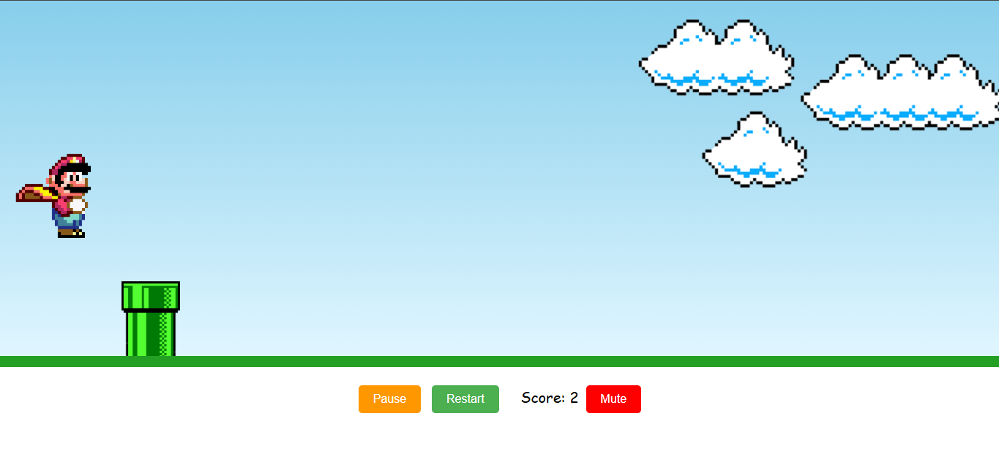
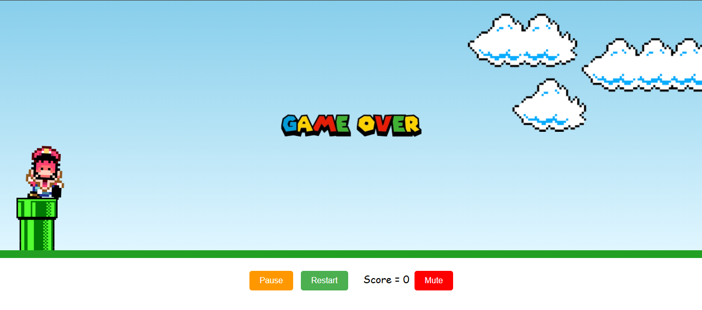

Mario's Jump - O Jogo de Plataforma Definitivo
Bem-vindo ao Mario's Jump, um jogo de plataforma inspirado no clássico Super Mario Bros, desenvolvido com HTML, CSS e JavaScript. Este projeto foi criado para proporcionar uma experiência divertida e nostálgica, com foco em dispositivos desktop. Prepare-se para pular, desviar de obstáculos e acumular pontos enquanto explora o mundo de Mario!

🎮 Funcionalidades
1. Jogabilidade Dinâmica
Pulo do Mario: O jogador pode fazer o Mario pular pressionando qualquer tecla ou clicando na tela.
Desvio de Obstáculos: O objetivo é desviar do pipe (cano) que se move continuamente da direita para a esquerda.
Contador de Pontos: Cada vez que o Mario ultrapassa um pipe, o jogador ganha +1 ponto.
2. Controles Intuitivos
Botão Start: Inicia o jogo e ativa a música de fundo.
Botão Pause/Continue: Pausa o jogo e permite retomá-lo de onde parou, salvando o progresso.
Botão Restart: Reinicia o jogo, zerando o contador de pontos e recomeçando a experiência.
3. Feedback Visual e Sonoro
Música de Fundo: Uma trilha sonora clássica de Mario toca enquanto o jogo está ativo.
Som de Game Over: Ao colidir com o pipe, a música de fundo é interrompida e uma música de Game Over é reproduzida.
Imagem de Game Over: Uma imagem animada sobe na tela para indicar o fim do jogo.
4. Design Responsivo para Desktop
O layout foi projetado exclusivamente para dispositivos desktop, com elementos centralizados e ajustados para diferentes resoluções de tela, incluindo monitores Full HD e 4K.
🛠️ Lógica por Trás do Projeto
1. Estrutura do Jogo
O jogo é composto por uma game board onde os elementos principais (Mario, pipe, nuvens) interagem.
A lógica principal é controlada por um loop contínuo (setInterval) que verifica:
A posição do Mario e do pipe.
Colisões entre o Mario e o pipe.
Se o Mario ultrapassou o pipe para incrementar o contador de pontos.
2. Controle de Estados
gameStarted e gamePaused: Variáveis que controlam o estado do jogo (iniciado, pausado ou em execução).
score: Variável que armazena a pontuação do jogador.
3. Animações
CSS Keyframes: Utilizados para animar o pipe, o pulo do Mario e as nuvens no fundo.
Imagem de Game Over: Animada com keyframes para subir na tela ao final do jogo.
📂 Estrutura do Projeto

📦 Jogo Super Mario
├── 📂 assets
│   ├── clouds.png
│   ├── mario.gif
│   ├── pipe.png
│   ├── game-over-palavra.png
│   ├── 1-06 - Super Mario Bros..mp3
│   └── 2-69 - Game Over.mp3
├── 📄 index.html
├── 📄 style.css
└── 📄 scripts.js

🚀 Como Jogar
Clone este repositório:
git clone https://github.com/seu-usuario/marios-jump.git

Abra o arquivo index.html no navegador.

Clique no botão Start para iniciar o jogo.

Use qualquer tecla ou clique na tela para fazer o Mario pular.

Desvie dos pipes e acumule pontos.

Pause, reinicie ou mute o som conforme necessário.

📱 Design Responsivo para Desktop
O layout foi projetado para funcionar perfeitamente em dispositivos desktop, com suporte para resoluções Full HD e 4K.

Elementos como o Mario, pipe, botões e contador de pontos são ajustados para manter a proporção e a centralização em telas grandes.

📸 Capturas de Tela

Tela Inicial

Durante o Jogo

Game Over

💡 Ideias Futuras
Adicionar níveis de dificuldade com pipes mais rápidos.
Implementar power-ups, como invencibilidade temporária.
Adicionar um ranking global para comparar pontuações.

🖋️ Créditos
Projeto Base: Este projeto foi inspirado e iniciado a partir de um tutorial compartilhado pelo canal do YouTube Manual do Dev.
Melhorias e Implementações:
Adição de músicas (trilha sonora e som de Game Over).
Implementação de botões funcionais: Start, Pause/Continue, Restart e Mute.
Criação do sistema de pontuação (score) com incremento dinâmico.
Feedback visual com animações e imagem de Game Over.
Ajustes no layout para suporte a resoluções Full HD e 4K.
Refinamento do código e melhorias gerais na jogabilidade.

Desenvolvedor: Bruno Pinheiro
Inspiração: Super Mario Bros
Tecnologias: HTML, CSS, JavaScript

📜 Licença
Este projeto é licenciado sob a MIT License.

🌟 Contribua
Contribuições são bem-vindas! Sinta-se à vontade para abrir issues ou enviar pull requests.